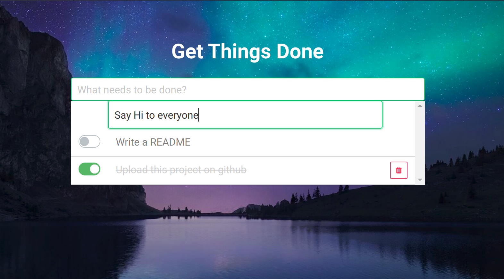

# Get Things Done

A simple, elegant and no-nonsense task manager.

# Introduction
This project is built with Laravel and Vuejs. If you find this interesting and find something you can learn from it.
Following these steps to clone and test it on your server:

``git clone https://github.com/remmyle1102/GetThingsDone``

Move this project to your server. Then run this command:

``composer update``

If it shows 500 error code, you should make sure you have permission to run.

Run this command to generate an encryption key.

``php artisan key:generate``

Create database and run ``php artisan migrate``
# Troubleshooting
If something does not work as expected. Please let me know, I really appreciate it.