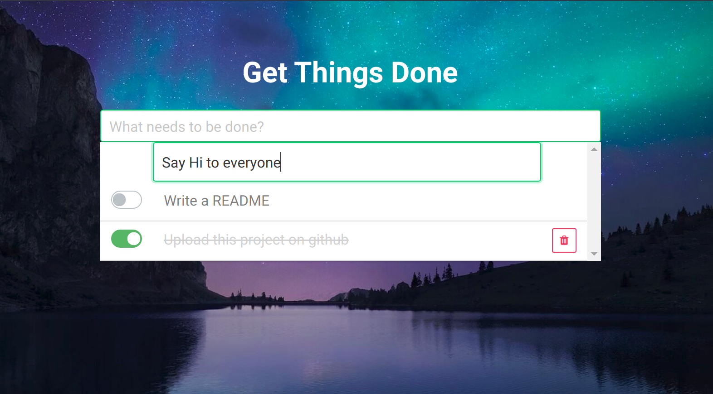

# Get Things Done
This project is built with Laravel and Vuejs. A simple, elegant and no-nonsense task manager.

# Installation

1. Clone repo

``git clone https://github.com/remmyle1102/GetThingsDone``

2. Change directory

``cd GetThingsDone``

3. Copy .env file and modify with it your database config

``cp .env.example .env``

4. Install dependencies

``composer install``

5. Generate an encryption key

``php artisan key:generate``

5. Database migration

``php artisan migrate``

6. Open tinker to add dummy data to database

``php artisan tinker``

7. Create 3 dummy data

``factory(App\task::class, 3)->create();``

8. Install node modules

``npm install``

9. Build

``npm run production``

# Troubleshooting
If something does not work as expected. Please let me know, I really appreciate it.